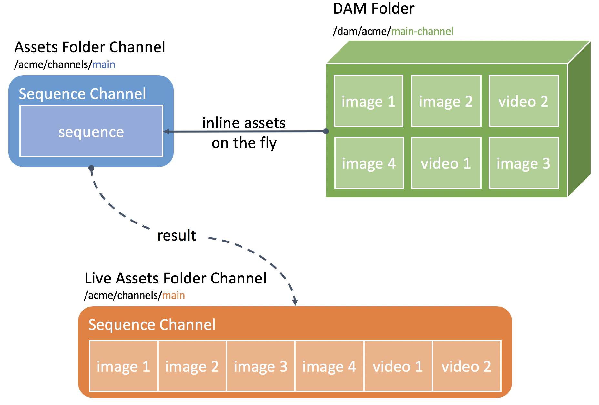

DAM-Driven Authoring Based on Assets Folder
===========================================

Use Case
--------

Acme Corp uses Screens to manage its digital signage displays in stores and show the top products of the seasonal collection on the displays. Acme Corp also outsourced all the digital assets handling to a local agency and that agency usually directly uploads its final assets to the DAM where the Acme authors will be able to pick them up for their content. In order to avoid having to manually edit channels whenever a new asset is provided by the design agency, Acme Corp wants to directly play all assets in a given DAM folder in its channel, effectively bypassing the Screens authoring if possible.

This how-to project walks you through how to achieve this DAM-driven channel authoring using a DAM folder and a custom _sequence_ to automatically inline any asset in the folder directly in the channel.

This module contains a sample on how to leverage a custom non-editable _sequence_ in a normal _sequence channel_ in order to directly load assets from a DAM folder and effectively disabling editing of the sequence. Contrary to the [damdriventags](../damdriventags/) sample, here the channel will still be editable, but the sequence itself will not let you drag & drop any assets since these are loaded directly from the DAM. The advantage is that you can actually preview all items that are included in the sequence without having to run the sequence, but it does require a few more setup steps as the initial channel has to be edited and its sequence needs to be configured to point to the DAM folder.


### Architecture Diagram



How to Use the Sample Content
-----------------------------

- Add/remove assets in the [DAM folder](http://localhost:4502/assets.html/content/dam/screens-howto/damdriven)
- Preview included assets by editing the [DAM-driven: Folder -  Channel](http://localhost:4502/editor.html/content/screens/screens-howto/channels/dam-driven-folder/channel.edit.html)
- Edit the _sequence_ properties to point to a different DAM folder

---

Technical Details
-----------------

### Compatibility

AEM version|Compatibility           |Comments
-----------|------------------------|--------
6.3        |:white_check_mark:      |
6.4        |:white_check_mark:      |

### Features built upon

The solution uses:
- A _sequence channel_
- A custom _sequence_ component inside the channel that resolves assets from the DAM rather than using child nodes

### Manual installation

This module requires HowTo project and is part of the install process. Follow [instructions here](../../README.md).

If you still want to install the module individually, you can run:

```
mvn clean install content-package:install
```

### Manual content setup

1. [Create a screens project](https://helpx.adobe.com/experience-manager/6-4/sites/authoring/using/creating-a-screens-project.html)
0. [Create a new _Assets Folder Channel_](https://helpx.adobe.com/experience-manager/6-4/sites/authoring/using/managing-channels.html#CreatingaNewChannel) for the main sequence
0. [Edit the channel](https://helpx.adobe.com/experience-manager/6-4/sites/authoring/using/managing-channels.html#WorkingwithChannels) and edit the sequence properties.
0. Point the _path_ property to the DAM folder that contains the assets to be used


Sample Content Links
--------------------

+ Content
    + [Main Channel](http://localhost:4502/screens.html/content/screens/screens-howto/channels/dam-driven-folder/channel)
    + [Main Channel - edition](http://localhost:4502/editor.html/content/screens/screens-howto/channels/dam-driven-folder/channel.html)
    + [Assets Folder](http://localhost:4502/assets.html/content/dam/screens-howto/damdriven)
