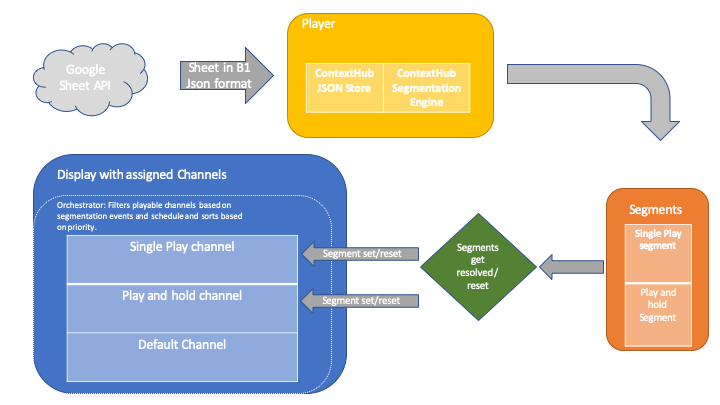

Data Triggered Channel Switch based on values returned by a Web Service API 
=========================

Use Case
--------


### Architecture Diagram



How to Use the Sample Content
-----------------------------

- Enable Data Trigger feature using the [Screens Data triggered Content (ContextHub) Feature Flag](http://localhost:4502/system/console/configMgr)
- Preview the [Data Triggers Web Service Display](http://localhost:4502/screens.html/content/screens/screens-howto/locations/data-triggers--web-service/main-office) in the Browser-Player.
- Create a new [Google Sheet](https://docs.google.com/spreadsheets/)
   The B1 and B2 values are used for this demo. Make sure the Worksheet is called "Sheet1". This can vary depending on the language settings in Google Sheet.  
- Add "FALSE" to the B1 and B2 columns.
- Get the sharable link of the newly created sheet. It contains the `sheet_id` which will be used later on.
- Enable the Google Spread Sheets Api from [Google Developer Console](https://console.developers.google.com/apis).
- Create an API key for the [Sheets API](https://console.developers.google.com/apis/credentials).
- Quick test: Open https://sheets.googleapis.com/v4/spreadsheets/{sheet_id}/values/Sheet1?key={api_key}. It should return a JSON containing the values of the sheet. If not: Make sure the Worksheet is called "Sheet1". This can vary depending on the language settings in Google Sheet.
- Go to the [ContextHub Configuration Wizard](http://localhost:4502/libs/granite/cloudsettings/content/wizard.edit.html/conf/screens/settings/cloudsettings/configuration/contexthub/datatrigger-service), click on "Next" and replace the "sheet_id" and "api_key" in the "Detail Configuration (JSON)" section with the values obtained at the steps above.
- Change the B1/B2 value from FALSE to TRUE in the Google Sheet and observe the Browser-Player.
- When B1 is set to TRUE, the [Single play channel](http://localhost:4502/editor.html/content/screens/screens-howto/channels/data-triggers--web-service/single-play.edit.html) will be displayed. After the sequence from 1-5 completes, Default channel is displayed.
- When B2 is set to TRUE, the [Play and hold channel](http://localhost:4502/editor.html/content/screens/screens-howto/channels/data-triggers--web-service/play-and-hold.html) will be displayed. The channel will keep displaying until B2 is reset, it's value is changed from TRUE to a different value.

---

Technical Details
-----------------

### Compatibility

AEM version|Compatibility     |Comments
-----------|------------------|--------
6.4        |:white_check_mark:|
6.5        |:white_check_mark:|
6.6        |:white_check_mark:|

Player     |Compatibility     |Comments
-----------|------------------|--------
Android    |:white_check_mark:|
iOS        |:white_check_mark:|
Windows    |:white_check_mark:|
Browser    |:white_check_mark:|

### Features built upon

The solution uses:

Content:
- a display with three channels assigned to it
- a default _sequence channel_ for the idle and timer events
- a single play _sequence channel_ which has the _single-play segment_ path and Playback Strategy set to Single Loop
- a play and hold _sequence channel_ which has the _play-and-hold segment_ path and Playback Strategy set to Play and hold

Config (ContextHub):

- a json segmentation store config that points to the Google Sheets API
- a segment that resolves when SINGLE_PLAY value is changed to TRUE in the Sheet
- a segment that resolves when PLAY_AND_HOLD value is changed to TRUE in the Sheet


### Manual installation

This module requires HowTo project and is part of the install process. Follow [instructions here](../../README.md).

If you still want to install the module individually, you can run:

```
mvn clean install content-package:install
```

### Manual content setup

Start by familiarizing yourself with:
    * [Context Hub](https://helpx.adobe.com/experience-manager/6-4/sites/developing/using/ch-adding.html) for Sites.
    * [Google Sheets API](https://developers.google.com/sheets/api/guides/concepts)
                           

1. [Create a screens project](https://helpx.adobe.com/experience-manager/6-4/sites/authoring/using/creating-a-screens-project.html).
2. Create a new Sheet and activate Google Sheets REST APIs.
3. Create a new ContextHub config based on the [existing one in this demo](http://localhost:4502/crx/de/index.jsp#/conf/screens/settings/cloudsettings/configuration/contexthub/datatrigger-service).
    - change configJson property in the Config to match the SheetId you just created in Google Sheets.
    - update also the API key
    Detailed steps can be found [here](https://wiki.corp.adobe.com/pages/viewpage.action?spaceKey=screens&title=How+to+integrate+Google+Sheets+with+ContextHub)

4. Create segments that will be resolved when their logic matches expected values set in the Google Sheet.
    - e.g: create one Segment which will be used for a "Single Loop" channel and one Segment for a "Play and Hold" channel.

5. Create channels and assign the desired Segment paths.
    - e.g: One channel would be used with the "Single Loop" segment and another one with the "Play and hold" segment
       created at step (4).

6. Create a default channel that will be used for idle,timer and initial load events.
    - e.g: this channel will be the idle channel, it will be used as a contrast to emphasis channel switches.
    
7. [Add locations](https://helpx.adobe.com/experience-manager/6-4/sites/authoring/using/managing-locations.html#CreatingaNewLocation) as needed, along with [their respective display](https://helpx.adobe.com/experience-manager/6-4/sites/authoring/using/managing-displays.html#CreatingaNewDisplay)

8. Assign the channels created at step (5) and (6) to the [display](https://helpx.adobe.com/experience-manager/6-3/sites/authoring/using/channel-assignment.html)
   - add Timer, Idle and Initial Load events to the default channel created at step (6)
   - set Segments Paths and Playback Strategy for the channels created at step (5) 

### Known issues
- In "single play" mode a sequence might switch to the first item of the sequence for a couple of milliseconds before switching back to the next scheduled Channel.
- Channel Switcher in Player: A datatriggered channel will prevent channel switch.

Sample Content Links
--------------------

+ Content
    + [Single play channel](http://localhost:4502/editor.html/content/screens/screens-howto/channels/data-triggers--web-service/single-play.edit.html)
    + [Play and hold channel](http://localhost:4502/editor.html/content/screens/screens-howto/channels/data-triggers--web-service/play-and-hold.edit.html)
    + [Default Channel](http://localhost:4502/editor.html/content/screens/screens-howto/channels/data-triggers--web-service/default-without-trigger.edit.html)
    
    + [Context hub config](http://localhost:4502/libs/granite/cloudsettings/content/wizard.edit.html/conf/screens/settings/cloudsettings/configuration/contexthub/datatrigger-service)
    + [Single Play segment](http://localhost:4502/crx/de/index.jsp#/conf/screens/settings/wcm/segments/single-play)
    + [Play and hold segment](http://localhost:4502/crx/de/index.jsp#/conf/screens/settings/wcm/segments/play-and-hold)
