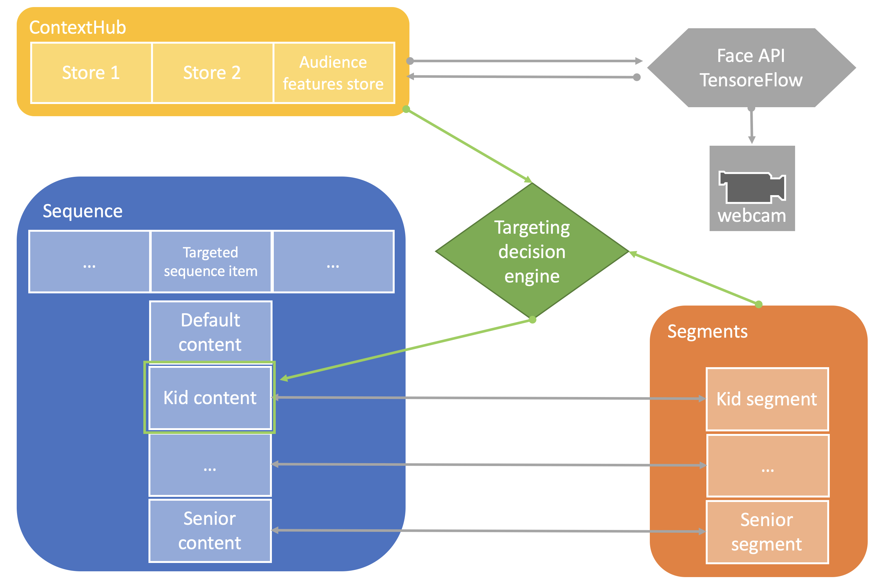

Face Detection data-triggers
============================

Use Case
--------

Acme Corp is a fast-food chain. The restaurants all have POS kiosk systems that let you order your prefered meal combo. In order to best anticipate the desired products, the kiosks are equipped with webcams that analyse the facial features of the audience to best guess the gender, age and current emotion of the customer. The kiosk system then adapts its featured products based on these criteria to increase sales.

This how-to project walks you through how to achieve this using a combination of webcam feed, machine learning based [facial detection](https://github.com/justadudewhohacks/face-api.js) built on top of [tensorflow.js](https://tensorflow.org/js) and [AEM's Personalization and Content Targeting](https://helpx.adobe.com/experience-manager/6-5/sites/authoring/using/personalization.html) features.

The project has a master sequence with 3 targeted text components. Each component personnalises the content based on some audience features (respectively age, gender and mood):
- 1st image will change depending on age (kid, teen, adult or senion)
- 2nd image will change depending on gender (male or female)
- 3rd image will change depending on emotion (happy, sad or angry)


### Architecture Diagram



How to Use the Sample Content
-----------------------------

1. Open the [sequence channel with face detection](http://localhost:4502/editor.html/content/screens/screens-howto/channels/data-triggers-mlfacedetection/master.html)
0. Switch to _Targeting_ mode
0. Select _Screens HowTo_ brand and _Face-detection Based Campaigns_ activity and hit the _Start Targeting_ button
0. Explore the different content variations by switching the different _Audiences_ and edit the content as needed
    - The default content
    - The content for the `kid`/`teen`/`adult`/`senior` age groups
    - The content for the `male`/`female` genders
    - The content for the `happy`/`sad`/`angry` moods
0. Switch then to _Preview_ mode
0. Expand the _ContextHub_ which shows the current audience information (if not visible).
0. Change your expression, or switch with a different person in front of the webcam to see content changed

---

Technical Details
-----------------

### Compatibility

AEM version|Compatibility           |Comments
-----------|------------------------|--------
6.4        |:white_check_mark:      |
6.5        |:white_check_mark:      |

### Features built upon

The solution uses:
- the [ContextHub](https://helpx.adobe.com/experience-manager/6-4/sites/developing/using/contexthub.html)
- the [Segmentation engine](https://helpx.adobe.com/experience-manager/6-4/sites/administering/using/segmentation.html)
- the [Content Targeting UI](https://helpx.adobe.com/experience-manager/6-4/sites/authoring/using/ch-previewing.html#UIModuleFeatures)
- the [Face API](https://github.com/justadudewhohacks/face-api.js) for the [Tensorflow.js](https://tensorflow.org/js) engine
- a Machine-Learning enabled Sequence Channel (regular sequence channel with tensorflow engine)

### Manual installation

This module requires HowTo project and is part of the install process. Follow [instructions here](../../README.md).

If you still want to install the module individually, you can run:

```
mvn clean install content-package:install
```

### Manual content setup

Start by familiarizing yourself with the concept of [Personalization](https://helpx.adobe.com/experience-manager/6-4/sites/administering/user-guide.html?topic=/experience-manager/6-4/sites/administering/morehelp/personalization.ug.js) and [Authoring Targeted Content Using Targeting Mode
](https://helpx.adobe.com/experience-manager/6-4/sites/authoring/using/content-targeting-touch.html) for Sites.

Note that we won't be describing how to create the custom _ContextHub Store_ and its _Content Targeting UI_, nor the _Personalization Segments_ and _Personalization Audiences_ setup as the steps will vary in the various AEM versions and links to the documentation have been provided above in the [Features built upon](#features-built-upon) section.

1. [Create a screens project](https://helpx.adobe.com/experience-manager/6-4/sites/authoring/using/creating-a-screens-project.html)
0. [Create a new _ML sequence channel_](https://helpx.adobe.com/experience-manager/6-4/sites/authoring/using/managing-channels.html#CreatingaNewChannel) for the master sequence
0. [Edit the channel](https://helpx.adobe.com/experience-manager/6-4/sites/authoring/using/managing-channels.html#WorkingwithChannels) and add assets or components as needed.
0. Edit the channel properties and click the _Personalization_ tab
    - set _ContextHub Path_ to `/conf/screens-howto/settings/cloudsettings/configuration/contexthub`
    - set _Segments Path_ to `/conf/screens-howto/settings/wcm/segments`
0. Click _Save & Close_ to save your changes
0. Edit the channel content and switch to _Targeting_ mode
0. Select _Screens HowTo_ brand and _Face-detection Based Campaigns_ activity and hit the _Start Targeting_ button
0. Select the component for which you want to have targeted content
0. Click the _Target_ button to enable targeting for that component
0. Define the content for each variation (default, age variants, gender variants and mood variants) by selecting the variation in the _Audiences_ in the side rail and adjusting the content as needed
0. Switch then to _Preview_ mode
0. Expand the _ContextHub_ which shows the current audience features information (if not visible).
0. Change your expression, or switch with a different person in front of the webcam to see content changed

#### Adding new segments

1. Create a new segment from [Audiences UI](http://localhost:4502/libs/cq/personalization/touch-ui/content/v2/audiences.html/conf/screens-howto)
0. Edite the segment properties and set the ContextHub Path to `/conf/screens-howto/settings/cloudsettings/configuration/contexthub`
0. Drag and drop a new property / value component
0. Edit the property to the desired feature to test, and set the value to the desired threshold
0. Edit the channel and switch to Targeting mode
0. Add the new segment to the list of audiences used on the right side
0. Adjust the targeted content in _Targeting_ mode


Sample Content Links
--------------------

+ Content
    + [Face-detection sample channel in DCC](http://localhost:4502/screens.html/content/screens/screens-howto/channels/data-triggers-mlfacedetection/master)
    + [Face-detection sample channel - edition](http://localhost:4502/editor.html/content/screens/screens-howto/channels/data-triggers-mlfacedetection/master.edit.html)
+ Rules / Segments (access: Navigation > Personalization > Audiences)
    + http://localhost:4502/libs/cq/personalization/touch-ui/content/v2/audiences.html/conf/screens-howto
+ ContextHub (access: Tools > Sites > ContextHub > screens-howto > ContextHub Configuration)
    + [Audience features store](http://localhost:4502/libs/granite/cloudsettings/ui/container.html/conf/screens-demo/settings/cloudsettings/configuration/contexthub)
