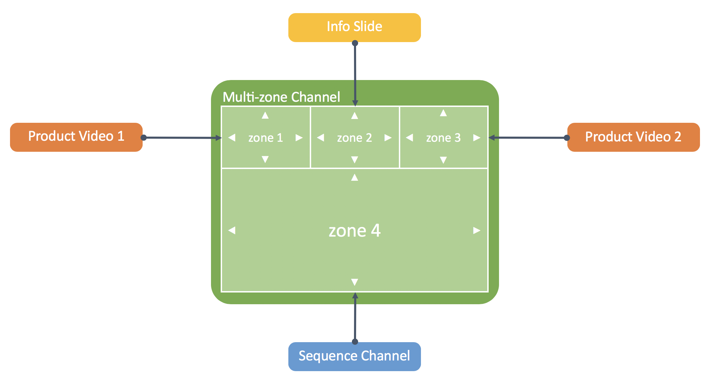

Multi-zone Channel Editor
=========================

Use Case
--------

Acme is a company that uses digital signage to relay messages to their customers. They use different layouts for their channels with multiple zones depending on their use case. For instance, they will show a 4-column layout with customer reviews for 4 highlighted products.

This how-to project walks you through how to create custom zone layouts by leveraging the responsive design editor to add and resize zones as needed.

The project relies on a custom _responsivegrid_ component and some authoring clientlibs that add 2-dimensional resizing options for the _Layout Containers_.
A _Multi-zone Screen Channel_ template is also provided to easily instantiate a new multi-zone channel.

### Architecture Diagram



How to Use the Sample Content
-----------------------------

1. Edit any of the channels in [Multizone Editor](http://localhost:4502/screens.html/content/screens/screens-howto/channels/multizone-editor) folder
0. Switch to _Layout_ mode
0. Select each zone and resize its width as needed by dragging the resize hotspots on each side
0. Select each zone and select the height for the zone using the action bar
0. Drag and drop components in each zone as needed
0. _Preview_ the channel

---

Technical Details
-----------------

### Compatibility

AEM version|Compatibility     |Comments
-----------|------------------|--------
6.3        |:white_check_mark:|
6.4        |:white_check_mark:|

### Features built upon

The solution uses:
- a custom _responsivegrid_ component that allows 2-dimensional resizing in _Layout_ authoring mode
- authoring hooks to inject vertical resizing options in _Layout_ authoring mode

### Manual installation

This module requires HowTo project and is part of the install process. Follow [instructions here](../../README.md).

If you still want to install the module individually, you can run:

```
mvn clean install content-package:install
```

### Manual content setup

1. [Create a screens project](https://helpx.adobe.com/experience-manager/6-4/sites/authoring/using/creating-a-screens-project.html)
0. [Create a new _multizone screen channl_](https://helpx.adobe.com/experience-manager/6-4/sites/authoring/using/managing-channels.html#CreatingaNewChannel)
0. [Edit the channel](https://helpx.adobe.com/experience-manager/6-4/sites/authoring/using/managing-channels.html#WorkingwithChannels) and add _Layout Container_ components for each zone you need.
0. Switch to _Layout_ mode
0. Select each zone and resize its width as needed by dragging the resize hotspots on each side
0. Select each zone and select the height for the zone using the action bar
0. Drag and drop components in each zone as needed


Sample Content Links
--------------------

+ Content
    + [Multizone Editor Channels Folder](http://localhost:4502/screens.html/content/screens/screens-howto/channels/multizone-editor)
        + [Right L-Bar with 4 zones channel](http://localhost:4502/screens.html/content/screens/screens-howto/channels/multizone-editor/lbar-right)
        + [Double-side L-Bar with 4 zones channel](http://localhost:4502/screens.html/content/screens/screens-howto/channels/multizone-editor/lbar-double)
        + [4-columns channel](http://localhost:4502/screens.html/content/screens/screens-howto/channels/multizone-editor/multicolumns)
        + [Jumbo Header with 2 zones channel](http://localhost:4502/screens.html/content/screens/screens-howto/channels/multizone-editor/header-2-zones)
